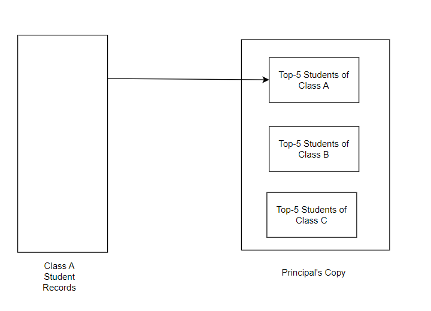
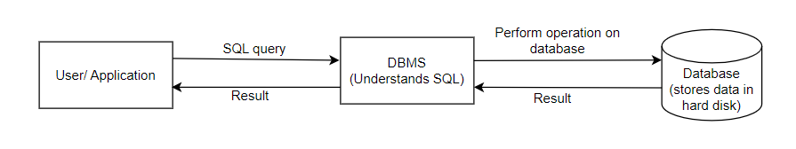
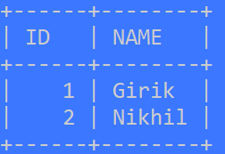

### Databases

Databases are one of the top rated skills any developer must have, so much that, if someone were to list the top 5 qualities to look for in a software developer, databases is one of them.

**What is a database?**

In earlier days, before the advent of databases, data used to be stored in flat files like Comma Separated Values (CSVs), Excel files, documents etc.

However, there are problems associated with using flat file system for storing data. Let's discuss some of them with examples:

1. Data Redundancy:

    Let's consider the example where different class teachers maintain a record of the students, along with the marks secured. Now, suppose there is a requirement from the principal, to report the top 5 students of their respective classes. Now, if an Excel or any other file based systems were being used, it would lead to redundancy of data, as the same records would be present in the class teacher's records as well as the principal's records. 

    

2. Data Inconsistency: 

    The problem of data inconsistency arises due to data redundancy. Say, the topper student X in class A updates their name to Y. Now, the name change has to be reflected in the principal's copy as well by manual updation, else there would be inconsistencies.

3. Difficult data access and lack of scalability: 
    The data is relatively difficult to access when stored in a flat file method, than if it was to access, if the same was stored in a database.

4. Access Control Policies:

    Though the flat file systems like Excel or documents do have access control and security policies in place, databases provide much more robust access control and security mechanisms.

5. Concurrency: 

    Handling concurrent read/write operations on flat file systems is trickier, than to handle these operations on databases.

In order to overcome the limitations of flat file systems, databases were invented.

A database is collection of related data.

Databases are preferable over flat file systems because of the following advantages:

1. Databases (if designed properly) ensure that the problems of data redundancy and data inconsistency do not occur

2. Databases provide easier data access and are easy to integrate with mobile apps, web apps etc.

3. Constraints: Databases allow to set constraints on the columns, which is a significant advantage over flat file based systems.

**Let's understand what DBMS is, and what is the correlation between SQL and DBMS**

A DBMS (Database Management System) is a software which provides an interface to interact with the database i.e. perform CRUD (Create, Read, Update, Delete) operations on the database. Examples of DBMS software include: MySQL, PostgreSQL, SQLite etc. All these DBMS softwares understand SQL (Structured Query Language). See the following diagram:

SQL is a declarative language which means that, while coding, you will not be interested in **how** you want the job done. The focus is on **what** result you want to obtain. As an example, one can use the `ORDER BY` or `GROUP BY` clauses to get the desired results, without worrying about the underlying implementation.

Different databases store data in different formats, some of them store data in the form of tables, other may store in the form of key value pairs, documents, graphs etc. 

**What is RDBMS?**

Relational Database Management System is a type of DBMS that allows to interact with a relational database i.e. perform CRUD operations on a relational database. 'Relational database' here means database which stores data in the form of tables.

Let's explore a little more about tables:

Each table, also called a relation, represents a real life entity set (in this example, employee represents a real life entity set). The columns of the table, represent the attributes of the entity set(in this example, ID and NAME are attributes of the employee entity set). Each row or record or tuple represents an instance of that entity set (as an example, here 'Girik' represents an instance of the entity set 'EMPLOYEE').

**How are databases and tables related to each other?**

A database has a collection of tables. As an example, a database 'Organization' may have tables for 'Employee', 'Department' etc.

Relational databases are called 'relational' because the tables are often related to each other by foreign key constraints etc.

For the purpose of this cohort, we'll be using MySQL RDBMS. MySQL can be used either as CLI or GUI, MySQL Workbench is the GUI version of RDBMS.