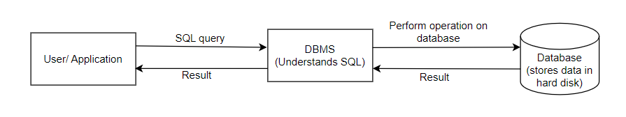

**Let's begin by understanding the difference SQL and MySQL - only a handful of people understand it**

SQL is the language which allows to interact and perform operations on databases, whereas MySQL is an RDBMS which understands SQL and allows to perform operations on databases. There are other RDBMS softwares, which too understand SQL and can perform operations on databases. Example: OracleSQL, PostgreSQL, MariaDB etc. The diagram below summarises it quite beautifully:

**Difference between CHAR and VARCHAR in SQL**

CHAR(N) reserves the space for N characters, irrespective of the actual length of the string stored. 

VARCHAR(N) takes up only as much space as the string, and allows a maximum of N characters to be stored.

All the SQL queries from the lecture are attached in the SQL file.