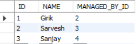
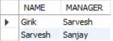
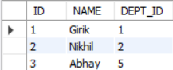
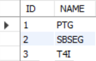
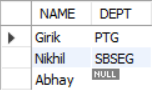
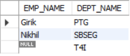
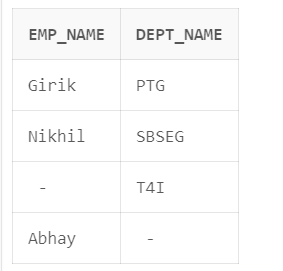
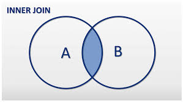
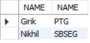
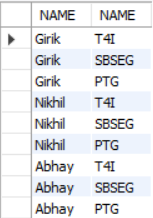

**What is a join in SQL?**

The JOIN clause in SQL is used to combine records from two or more tables in a database.

The different types of joins in SQL are:

1. Self Join: 

    A table is joined with itself. This happens when an entity is relationship with itself. As an example, consider an EMP table with the attributes EMP_ID, EMP_NAME, MANAGED_BY_EMP_ID. Now, if we have a usecase to print the employee name along with their manager name, we will use SELF JOIN as follows:

```
SELECT EMP.EMP_NAME,EMP1.EMP_NAME FROM EMP,EMP AS EMP1 WHERE EMP.MANAGED_BY_EMP_ID = EMP1.EMP_ID;
```

NOTE: It is necessary to alias the table when using a SELF JOIN, so that SQL can differentiate between the two table references.

Hands on example:





2. Left Outer Join (a.k.a. LEFT JOIN):

    This is a type of join where all the records from the left table are returned, along with matching rows from the right table. In case there is no match from the right table, NULL is returned for all columns from the right table.

Example: Consider two tables: Customer with attributes CUST_ID, CUST_NAME, Phone Number, ORDER_ID

and table ORDER with attributes ID, Shipment Number.

Consider an example, where we want to get the data of all the customers, along with the shipment number of the order ID (if any), we can use LEFT JOIN as follows:

```
SELECT Customers.NAME,Orders.SHIPMENT_NUMBER FROM Customers LEFT JOIN ORDERS ON CUSTOMERS.ORDER_ID = ORDER.ID;
```

In terms of Venn Diagram, a LEFT JOIN can be visualized as:


Hands on example:







3. Right Outer Join (a.k.a RIGHT JOIN): 

    Right Join is a type of join in which all the records from the right table are included, along with matching records from the left table. If there are records in right table which don't have matching records in left table, NULL is used for the columns from the left table.

Example: Consider two tables: LOAN(LOAN_ID,BANK_ACCOUNT_ID,LOAN_AMOUNT) and BANK_ACCOUNT(ACCOUNT_ID,ACCOUNT_HOLDER_NAME). Now if there is a usecase to print all the bank accounts, along with the loan amount (if any), we can use RIGHT JOIN, like:

```
SELECT BANK_ACCOUNT.ACCOUNT_HOLDER_NAME,LOAN.LOAN_AMOUNT, FROM LOAN RIGHT JOIN BANK_ACCOUNT ON LOAN.BANK_ACCOUNT_ID = BANK_ACCOUNT.ACCOUNT_ID;
```

In terms of Venn Diagram, RIGHT JOIN can be visualized as follows:


Hands on example:




4. Full Outer Join (a.k.a FULL JOIN): 

    Full Join is the set union of both LEFT JOIN and RIGHT JOIN. 

Example:

Consider CUSTOMER(CUSTOMER_ID,NAME,PHONE_NUMBER,ORDER_ID) and ORDER(ID,AMOUNT,SHIPMENT_NUMBER), if we have a use case to display the customers  (if any) along their orders (if any).

Here's the query we can use along with a sample of what the result set would look like:

```
SELECT CUSTOMER.NAME,ORDER.SHIPMENT_NUMBER FROM CUSTOMER FULL JOIN ORDER ON CUSTOMER.ORDER_ID = ORDER.ID;
```

A sample of what the result set would look like:

```
Customer Name   Shipment Number
Girik           1234
Nikhil          NULL
NULL            7389
Mahesh          6677
```

FULL Join can be visualized as follows in terms of Venn Diagram:


Note: MySQL doesn't support FULL JOIN as yet. Can try this on LiveSQL by Oracle.

If we have a usecase where we want to compute the full join wihtout using the `FULL JOIN` keyword, we can do so by taking the union of LEFT and RIGHT Join, as follows:

```
(SELECT * FROM CUSTOMER LEFT JOIN ORDER ON CUSTOMER.ORDER_ID = ORDER.ID) UNION 
( SELECT * FROM CUSTOMER RIGHT JOIN ORDER ON CUSTOMER.ORDER_ID = ORDER.ID);
```

Hands on example:





5. Inner Join: 

    Inner Join is a type of join which is used to select the records having matching values in both tables.

Example: Consider two tables EMP(EMP_ID,NAME,DEPT_ID) and DEPT(ID,NAME), and we have a usecase to print the department name against every employee name. We can do that by using INNER JOIN, using the below query:

```
SELECT EMP.NAME,DEPT.NAME FROM EMP INNER JOIN DEPT ON EMP.DEPT_ID = DEPT.ID;
```

In terms of Venn Diagram, INNER Join can be visualized as:



Hands on example:




Note: The default join is INNER JOIN in SQL, if only 'JOIN' keyword is specified.

Another important point: If the column names in both the tables is same, we can use the `USING` clause instead of using `ON` clause. As an example, 

`SELECT * FROM A INNER JOIN B ON A.ID = B.ID`

can be replaced with:

`SELECT * FROM A INNER JOIN B USING(ID)`

6. Cartesian Join (a.k.a CROSS JOIN): 

    Cartesian Join is a type of join where a cartesian product of the rows from both the tables is performed (i.e. every row from the left table is joined to every row from the right table)

The syntax for Cartesian Join is as follows:

    
```
    SELECT * FROM EMP,DEPT;
                or
    SELECT * FROM EMP CROSS JOIN DEPT;
```
    
Note: CROSS JOINs don't have ON clauses as everything from left table is joined with everything from right table.

Hands on example:




[Real life usecases of Cartesian Join](https://www.quora.com/What-are-some-practical-uses-of-SQL-Cartesian-Joins)

CAUTION: Using joins without specifying the join condition leads to cartesian product being computed by default! Always make sure to specify the join condition.

As an example, using the following SQL query will lead to cartesian join being computed :

```
SELECT * FROM A INNER JOIN B
```

**Set operations in SQL**

1. UNION

    The UNION operator in SQL is used to combine the result set of multiple SELECT statements and return one result set.

    Example:

    ```
    SELECT * FROM EMP WHERE DEPT_ID = 2 UNION SELECT * FROM EMP WHERE EMP_NAME = 'Girik';
    ```

    Conditions for UNION operator in SQL:

    1. Every SELECT statement within UNION must have the same number of columns

    2. The columns must also have similar data types

    3. The columns in every SELECT statement must also be in the same order

2. UNION ALL

    This is similar to UNION, but includes any duplicates twice in the result set.

    Example:

    ```
    SELECT * FROM EMP WHERE DEPT_ID = 1 UNION ALL SELECT * FROM EMP WHERE NAME = 'Girik'; 
    ```

3. INTERSECT

    INTERSECT operation in SQL is used to retrieve the records that are common between the result sets of two queries.

    Example:

    ```
    SELECT * FROM EMP WHERE DEPT_ID = 1 INTERSECT SELECT * FROM EMP WHERE NAME = 'Girik';
    ```

4. MINUS

    MINUS operator in SQL returns the records that are present only in the result set of first query, but not the second one.

    Example:

    ```
    SELECT * FROM EMP WHERE DEPT_ID = 2 MINUS SELECT * FROM EMP WHERE NAME = 'Girik';
    ```

Natural Join: This is a JOIN operation which creates the join based on the common columns in the tables.

Example: 

```
SELECT * FROM EMP NATURAL JOIN DEPT;
```

will create a join between EMP and DEPT table on all common columns (having common column names and datatypes) in EMP and DEPT tables.

**Difference between Inner and Natural Joins**

In case of an Inner join, the join condition has to be explicitly specified, whereas in case of a natural join, the join is computed using all the common columns from the tables.

All the SQL queries from the lecture are attached in the SQL file.