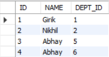

## Functional Dependencies and Normalization ##

Let's discuss about database schema.

Database schema is blueprint of the actual DB. It contains information about the DB stores data, structure of tables etc. Database schema can be created programmatically (instead of using SQL queries) by using different packages in libraries and frameworks like Express or Ruby on Rails etc.

Database instance refers to the collection of data that the database stores at any particular moment.

Analogy: Class is to object as schema is to instance.

**What is a functional dependency?**

A functional dependency defines the relationship between attributes. A functional dependency X->Y (read as, X functionally determines Y), means that for every valid value of X, we can uniquely identify Y.

Formally speaking, X is called the determinant and Y is called the dependent in the functional dependency X->Y

As an example, consider the following table:



The functional dependencies ID -> NAME and ID -> DEPT_ID are valid functional dependencies because corresponding to every value of ID, we have one and only one value of NAME and DEPT_ID.

The functional dependency NAME -> DEPT_ID is not valid because the NAME doesn't uniquely identify the DEPT_ID.

**What is the use of functional dependencies?**

Functional dependencies help in better database design. They help in identifying the keys of the table, find out anomalies in the table and ultimately pave the road for normalization.

An interesting read:

Let's say we are given a table with attributes A,B and C, and we want to assert whether the functional dependency A->B, A->C are valid or not. Most RDBMS softwares don't support these assertions. Assertions are a part of SQL standard, but most RDBMS don't implement the assertions.

[SQL-92 Standard which talks about Assertions](https://www.contrib.andrew.cmu.edu/~shadow/sql/sql1992.txt)

The pseudocode for the assertion to check for functional dependency, according to the SQL standard would be:

```
CREATE ASSERTION EMP_NAME_FD AS CHECK (NOT EXISTS (SELECT * FROM EMP AS E1, EMP AS E2 WHERE E1.E_ID = E2.E_ID AND E1.E_NAME <> E2.E_NAME))
```

The idea here is to check whether there exist two different rows in the table, which have the same employee ID but not the same employee name. This way, we can assert whether employee ID functionally determines employee name or not.

**Axioms for functional dependencies**

These axioms are going to be useful in identifying the keys of the relation.

1. Reflexivity: If X is a subset of Y, then Y functionally determines X. (Y -> X)

As an example, consider three attributes address, city and house number. Now, city and house number are both subsets of address. So, the functional dependencies address -> city and address -> house number are valid.

2. Augmentation: If X -> Y, then XZ -> YZ for any attribute Z.

As an example, if emp_id -> emp_name then emp_id emp_email -> emp_name emp_email. As the combination of emp_id and emp_email can uniquely identify the combination of emp_name and emp_email

3. Transitivity: If X->Y and Y->Z, then X->Z.

As an example, EMP_ID -> EMP_EMAIL and EMP_EMAIL -> EMP_NAME, so by rule of transitivity EMP_ID -> EMP_NAME which is valid as EMP_ID functionally determines EMP_NAME

There are some other axioms as well, but they have very limited real life usecases. Hence, not discussing them here.

**Database keys**

Keys (or superkeys) are set of attributes that help to uniquely identify the tuples in the relation. As an example, for a table EMP, the possible superkeys are: EMP_ID, EMP_ID EMP_EMAIL, EMP_ID EMP_NAME, EMP_ID EMP_EMAIL EMP_NAME etc.

There are different types of keys, let's explore them one by one :

1. Composite Key: A composite key is a combination of two or more attributes that are used to uniquely identify all the tuples in the table. It is also important to note that the individual attributes of the composite key are not keys themselves (they are not sufficient to identify the tuples), but the combination of these attributes is a key. As an example, AADHAR_NAME AADHAR_PHONE_NUMBER is a composite key that can be used to uniquely identify all the rows in the table.

2. Candidate Key: Candidate key is a minimal super key, meaning that a candidate key doesn't have any redundant attributes. As an example, EMP_ID EMP_PHONE is a superkey but not a candidate key, because the attribute EMP_PHONE in this superkey is redundant. However, EMP_ID is a candidate key because it doesn't have any redundant attributes and can uniquely identify all the tuples in the table.

3. Primary Key: Primary key is a **non-null unique** candidate key, that can be used to uniquely identify the tuples in the table.

4. Alternate Key: All candidate keys apart from the primary key are alternate keys.

5. Foreign Key: It is a set of attributes in one table that references the primary key of another table.

As an example, consider the two tables EMP (EMP_ID, EMP_NAME,DEPT_ID) and DEPT (DEPT_ID,DEPT_NAME,DEPT_ADDRESS). DEPT_ID in EMP table is a foreign key which references the primary key DEPT_ID of DEPT table.

**How to identify candidate keys for a relation, given the functional dependencies?**

As an example, consider the relation R(A,B,C,D,E) and the following set of functional dependencies:

1. A -> B

2. A -> E

3. C -> B

4. C -> E

5. B -> D

Before we discuss the solution of this problem, let's understand some terms:

1. Functional Dependency Closure: Functional Dependency Closure (denoted by F*) contains all the rules that are implied by the set of functional dependencies. As an example, given the set of FDs {A->B, C->D, B->C}, the Functional Dependency Closure (F*) can be computed as {A->A, A->B, A->C, A->D, B->B, B->C, B->D, C->C, C->D }. Functional dependency closure need not be computed everytime formally, with experience, it can be calculated on the fly.

2. Attribute Closure: Attribute Closure describes all the attributes that can be determined using an attribute. As an example, consider the FDs { A->B, C->D, B->C}, the attribute closures can be computed as:

A(+) = {ABCD}

B(+) = {BCD}

C(+) = {CD}

D(+) = {D}

Here are the steps that will be helpful while finding the candidate keys from the functional dependencies:

1. If there is an attribute which is only present on the LHS of the functional dependencies or an attribute which is not present in both the LHS and RHS of any of the FDs, it must be surely present in the candidate key. Why? 

    1. Because if an attribute is present only in the LHS of FDs, it cannot be determined by any attribute. Hence, it is a necessity to include it in the candidate key.

    2. Because if an attribute is neither present in LHS nor RHS of any of the FDs, then there is no attribute that can determine this attribute. Hence, it is a necessity to include it in the candidate key.

2. If an attribute is present only in the RHS of the FDs, then that attribute will surely not be a part of the candidate key. Why?

    1. Because if an attribute is present only in the RHS of the FDs, it means that the attribute is not contributing to determine any other attributes. It also means that the attribute will ultimately be determined by some other attribute. Hence, the attribute shouldn't be a part of the candidate key.

3. If an attribute is present in both LHS and RHS of FDs, it may or may not be a part of the candidate key.

4. We start with the information about the attributes that we are 100% sure and unsure about being in the candidate key. Compute the closure of these set of attributes and check whether all the attributes are covered. Add the unsure attributes, if necessary in case the closure doesn't cover all the attributes.

Refer this [article](https://www.javatpoint.com/how-to-find-candidate-key-from-functional-dependencies) for more information.

Let's now consider some examples for computation of candidate key:

Q1. Consider the relation R(A,B,C,D,E) and the following set of functional dependencies:

1. A -> B

2. A -> E

3. C -> B

4. C -> E

5. B -> D

A1. 
    Attributes present only in LHS: A,C
    Attributes present only in RHS: D,E
    Attribites present on both: B

    Let's try closure of AC = {A,C,B,E,D} which are all the attributes.

    Hence, the candidate key is AC.

Q2. Consider the relation R(A,B,C,D) with the following set of functional dependencies: 

1. AB -> C
2. BC -> D 
3. CD -> A 

A2. Attributes only in LHS: B
    Attributes only in RHS: None
    Attributes in both LHS and RHS: C,D,A

    Let's try closure of B = {B}

    We need more attributes.

    Let's try closure of BA = {BACD} which is all the attributes

    Let's try closure of BC = {BCDA} which is all the attributes

    Let's try closure of BD = {BD} which doesn't have all the attributes, and also it is not worth adding more attributes like A or C here, because then attribute D would become redundant as BA and BC are already candidate keys.

    Hence, the candidate keys are BA and BC.

Tip: Sometimes questions like find the length of candidate key for given set of FDs are asked in MCQs.