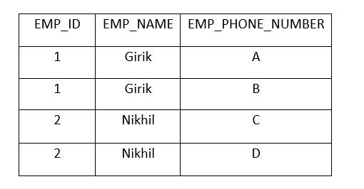

## Normalization

**What is normalization and why do we need it?**

Normalization is the systematic approach to decompose tables to eliminate data redundancy and avoid undesirable effects like insertion, updation and deletion anomalies.

Normalization is needed for good database design. A good database design is scalable and performant, and makes the overall application faster.

It's important to note that there are two approaches to design a database:

1. E-R Modelling: This involves identifying the entities and their relations. Then, we convert the ER diagram to tables. This is the top-down approach to design a database.

2. Normalization: In this approach, we start with the data in the table, and then use the normalization techniques to refine the database design. 

Reference Link: [Youtube](https://www.youtube.com/watch?v=bSUiOqf7rtM&list=PLVCEF4zOWjkhPA1jIOk1PcC_DejxQFTcL&index=36)

In order to quantify the data redundancy, we use different normal forms, which are:

1. 1NF : Highest level of data redundancy

2. 2NF 

3. 3NF

4. 3.5 NF (Boyce Cordd Normal Form - BCNF)

5. 4NF 

6. 5NF : Lowest level of data redundancy

**First Normal Form**

A table is said to be in 1NF if:

1. All attributes contain only atomic values. 

2. All entries (intersection of tuples and columns) follow the domain constraints of their respective columns.

Example:

Table not in 1NF:

Table, after converting to 1NF:

**Some important points to keep in mind before discussing 2NF and 3NF**

1. Both 2NF and 3NF revolve around non-prime attributes.

2. Some incorrect sources on the Internet might use 'primary key' instead of 'candidate key' in the definitions, but the correct definitions always use 'candidate key' and not 'primary key'. [Source](https://stackoverflow.com/questions/71969128/is-normalisation-done-on-the-primary-key-or-on-the-candidate-keys)

3. Try to use definitions in the affirmative 'There should be X' than saying 'There should be no Y'.

**Second Normal Form**

Let's understand about Full functional dependency before discussing 2NF: A full functional dependency exists when for a functional dependency X -> Y, there exists no proper subset of X (let's call it Z) such that Z -> Y. 

What is a non-prime attribute? 

A non-prime attribute is an attribute which is not a part of any **candidate key** of the relation. (It's important to note that the definition talks about all possible candidate keys, and not only the primary key.)

As an example, consider the relation R(A,B,C,D) with the following FDs:

AB-> CD, D->A

Let's find out all the possible candidate keys for this relation, using the technique discussed previously.

B occurs only on LHS, hence definitely a part of the candidate key.

C occurs only on RHS, hence definitely not a part of candidate key.

BA closure = {BACD}

BD closure = {BDAC}

Hence candidate keys are {AB, BD}, prime attributes are {A,B,D} and non-prime attribute is {C}

A table is said to be in second normal form if:

1. The table is in 1NF already. [Don't forget this condition]

2. All non-prime attributes are fully functional dependent on candidate keys. [Reference Link](https://bohr.wlu.ca/cp363/notes/theory/17_2nf.php#:~:text=All%20non%2Dprime%20attributes%20of,relation%20is%20automatically%20in%202NF.)

**Note that condition 2 is very precise in nature. Be mindful of not rephrasing it.**

Let's consider an example to understand how can normalize a table to 2NF:

Let's see the functional dependencies for the table:

1. Student_ID -> Student_NAME

2. Student_ID Course_ID -> Student_Name

We see that the non-prime attribute Student_Name is not fully dependent on the candidate key Student_ID, Course ID. Hence, the table is not in 2NF.

Let's see how this table suffers from anomalies:

1. Insertion Anomaly : Insertion anomaly is an anomaly which occurs when we are unable to insert a record into a table because of the absence of some data. As an example, in the table above, consider that a new student has not enrolled in any course yet. Due to this reason, we won't be able to insert the record of this student into the table, because of the non null constraint on course_id and course_name.

2. Updation Anomaly: Updation anomaly is an anomaly which occurs when data change needs to be done at multiple places. Moreover, if the data is not updated at some places due to any reasons, the table will have inconsistent data. As an example, if we want to update the student ID 1 from 'Girik' to 'Manoj', we'll have to do that at multiple places. Moreover, if this update is not done at some places due to any reasons, the table would have inconsistent data.

3. Deletion Anomaly: Deletion anomaly is an anomaly which occurs when deleting row(s) from table also leads to unintentional loss of data. As an example, in the table above, deleting information about student 'Ayush' will also lead to loss of information about the course 'OOPS'.

We can decompose this table to 2NF, by decomposing to two tables Student and Course. Also, as the relation between Student to Course is Many to Many (as 1 student can be enrolled in multiple courses, and 1 course can have multiple students enrolled in it.) So, we would also need a Student_Course_Join table to store the mapping between Student_ID and Course_ID.

Here are the tables are decomposing to 2NF:

The tables are now in 2NF, and we can validate the same by checking the functional dependencies. All non-prime attributes are fully functional dependent on the candidate keys.

The decomposed tables are now free from the anomalies discussed above. 

In order to get some information that needs context from multiple tables (as an example, print the student_id along with course name for every student), we can join the STUDENT_COURSE_JOIN and Course tables. 

Disadvantages of normalization: 

1. Having multiple tables increases the space usage. Let's discuss this in detail. Let's talk about this in detail, consider the example above. Let's say we have M students and N courses, then the space complexity of unnormalized table is O(N*M) (considering the worst case scenario where every student is associated with every course). In the normalized tables, the Student table takes O(M) space, the Courses table takes O(N) space and the Student_Courses_Join table takes O(M * N) space in the worst case. The extra space of O(M) + O(N), in case of normalized tables, is a tradeoff with the efficiency  that normalization offers.

2. Join operation needed when combining information from multiple tables is expensive.

Let's take a look at an alternative design and discuss its limitations:

This is the format in which data in Excel is sometimes stored. Let's discuss the problems with this database design:

1. Fundamentally speaking, attributes in a table represent the properties of an entity. Strictly speaking, DSA_enrolled, OS_enrolled and OOPS_enrolled are not properties of the Student entity.

2. A lot of space is being wasted for storing 'No' for different attributes. This is not a sparse implementation.

3. The Course data is being tightly coupled with the Student data, so the Course data cannot be used elsewhere.

**Third Normal Form**

A table is said to be in 3NF if:

1. The table is already in 2NF.

2. No non-prime attribute functionally determines another non-prime attribute 

Let's understand with example, a table which is not in 3NF:

The functional dependencies for this table can be identified as:

ID -> City

ID -> Country

City -> Country

ID City -> Country

ID Country -> City

The candidate keys can be identified as {ID}, the prime attributes are {ID} and non-prime attributes are {City,Country}

The table is in 1NF already because of atomic values and domain constraints.

The table is in 2NF as well because all the non-prime attributes (City,Country) are fully functional dependent on the candidate key ID.

The table, however, is not in 3NF, because non-prime attribute City determines non-prime attribute Country, which is a violation of 3NF rules. Due to the table not being in 3NF, it suffers from updation, insertion and deletion anomalies.

Let's take a look at how we can normalize this table to 3NF:

**Important:** To understand a single rule which helps with decomposing table to a higher normal form from a table that is already in lower normal form, see [this](../Lecture-7/README.md#L63).

FDs for first table: ID -> City

FDs for second table: 
    City -> Country

Candidate keys for first table: {ID}

Candidate keys for second table: {City}

In both the tables, there is no instance where a non-prime attribute determines another non-prime attribute. Hence, the tables are in 3NF.

There is another definition for 3NF as well, which is slightly difficult than the first one, but for the sake of completion, let's discuss here:

A table is said to be in 3NF if:

1. The table is in 2NF already. (Don't forget this condition)

2. All non-prime attributes are non-transitively dependent on candidate keys. 

Reference for the definition: [Link](https://vertabelo.com/blog/normalization-1nf-2nf-3nf/)

As an example, in the table above, the non-prime attribute Country has transitive dependency on the candidate key ID, which is a violation of 3NF rules.

Let's take a look at an unnormalized table:

In the table above, we can see that there is a lot of data redundancy. We can remove the data redundancy by normalization and come up with the following database design:

