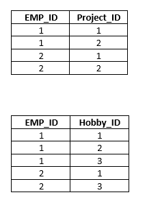
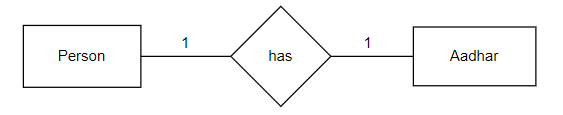
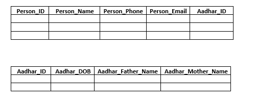
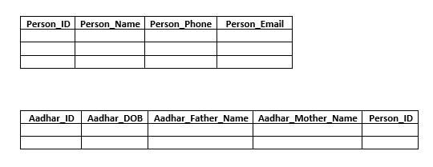
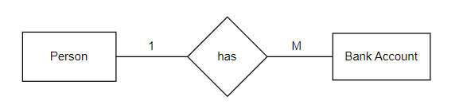
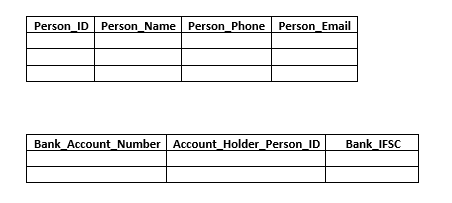
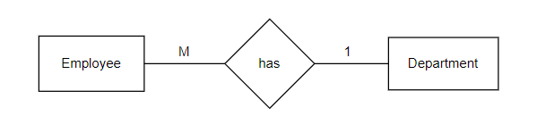
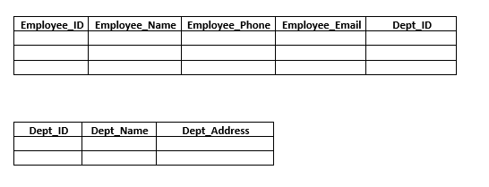
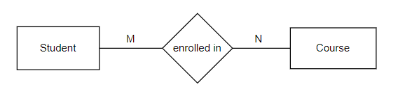
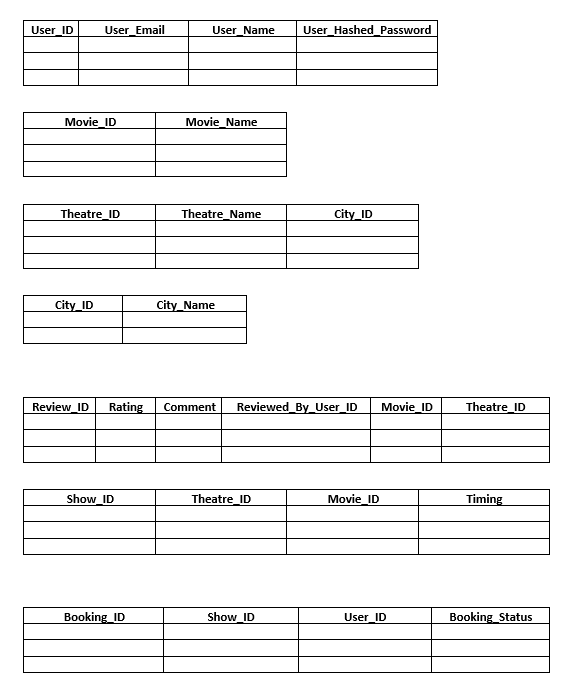

**Let's design a DB for Quora like App**

The requirements for the app are:

- User should be able to post a question
- User should be able to answer a question
- User should be able to comment on an answer
- User should be able to comment on a comment
- User should be able to like a comment or an question or answer
- User should be able to follow another user
- Every question can belong to multiple topics
- User can follow a topic
- You should be able to filter out questions based on topic

Here's the design proposed by me:

Few points in the design worth discussion:

1. In the comments table, we are storing refernce to both answer_id and comment_id. So, if the user comments on an answer, the reference_comment_id would be null, and similarly, if the user comments on another comment, the reference_answer_id would be null.

2. Theoretically speaking, we can have an enum for commentable_type with the possible values 'Comment' and 'Answer', and the store another attribute commentable_id which could reference the comment_id or the answer_id, as the case may be. However, practically speaking, that is not possible, because a foreign key cannot reference multiple tables in SQL. [Source](https://www.reddit.com/r/SQL/comments/tt6apj/foreign_key_reference_multiple_tables/?rdt=35886)

**BCNF**

BCNF (Boyce Cordd Normal Form) a.k.a 3.5 NF is a stricter version of 3NF. For a table to be in BCNF, two conditions must be specified:

1. The table must be in 3NF already.

2. The LHS of every functional dependency should be a superkey.

Let's take a look at an example of a table which is not in BCNF:

Consider a relation R(ABC) with the following functional dependencies:

1. AB -> C

2. C -> B

Let's start by finding the candidate keys for this relation.

A is on LHS of every FD, hence part of candidate key.

Closure of A = A, hence A is not the candidate key.

Closure of AB = ABC, hence AB is a candidate key.

Closure of AC = ACB, hence AC is a candidate key.

Prime attributes = {A,B,C} , Non prime attributes: {}

The table is in 1 NF already because of presence of atomic values.

The table is in 2NF as well because there are no non-prime attributes, hence no possibility of a non-prime attribute not being fully functional dependent on the candidate key.

The table is in 3NF as well because there are no non-prime attributes, hence no possibility of a non-prime attribute having a transitive dependency on the candidate key.

However, the table is not in BCNF. Because the LHS of the functional dependency C->B is not a superkey. Closure of C = CB (which is not equal to ABC)

Let's understand how we can convert this table into BCNF:

Firstly, form a set of all the attributes. Pick those functional dependencies which are in violation of the normal form, and form a table for each one of them. As an example, consider a relation R(ABCD) with the functional dependencies C->A and D->B which are violating the conditions for BCNF, we can form two different relations R1 (C,A) and R2(D,B) with FDs C->A and D->B respectively. Now, from the set (ABCD), delete the dependents (RHS of the FDs). So, from the set (ABCD) delete (AB) and we are left with (CD). Form another joining table between the attributes (C,D). This table is similar to the table created in an ER diagram with many to many mapping between the entities.

[Reference Video Link](https://www.youtube.com/watch?v=7ohUvHrgMWI) 

**Very important fact** : The technique discussed above is not only specific to BCNF, but is equally applicable for decomposing a table to a higher normal form from any lower normal form. Hence, feel free to use this technique while decomposing to any of the normal forms.

Here is a video tutorial leveraging this rule to decompose tables to 3NF:

[Decomposing relation to 3NF from 2NF](https://www.youtube.com/watch?v=FH-X0m9K-ZQ)

Coming back to the original question being discussed [here](./README.md#L35), the relation can be decomposed to BCNF as follows:

Initial set = { A ,B, C}

1. Relation R1(C,B) with the functional dependency C->B
2. Joining relation R2(A,C) after deleting B from the set

A real life example of R(ABC) with the FDs: AB->C and C->B and which is not in BCNF is:

Here, EMP_ID, ORG -> TEAM_LEAD and TEAM_LEAD -> ORG

**4NF**

Let's discuss about 4NF. 

For a table to be in 4NF, two conditions must be specified:

1. The table must be in BCNF already. (Important condition, don't neglect this)

2. There should be no multi-valued dependency in the table.

Let's understand about multi valued dependencies in detail:

A multi valued dependency exists if for a set of three attributes X, Y and Z, corresponding to one value of X, we have multiple values of Y and Z, but the set of values in Y and Z are independent of each other. [Link to definition](https://en.wikipedia.org/wiki/Multivalued_dependency#:~:text=A%20multivalued%20dependency%20exists%20when,set%20Z%20and%20vice%20versa.)

In such a case, it is said that X-->Y and X-->Z. (Read as, X multi-determines Y and X multi-determines Z)

Practically speaking, multi-valued dependency arises when we club different many to many relations in a table, as an example, there is a many to many relationship between employee and project, and employee and hobby. If all these three attributes are combined into a single relation, we'll have a multi-valued dependency.

Let's understand with the help of the following example:

In the above table, corresponding to a single value of EMP_ID, we have different values of Project_ID and similarly, corresponding to a single value of Emp_ID, we have different values of Hobby_ID. Also, it's important to note that Project_ID and Hobby_ID are independent of each other. Hence, EMP_ID --> Project_ID and EMP_ID --> Hobby_ID

Let's take a look at the functional dependencies of the table:

If we carefully observe, no attribute or set of attribute functionally determines other attribute. The candidate key for this relation is (EMP_ID,Project_ID,Hobby_ID)

Let's take a look at which normal form the above table is in.

The table is in 1NF already because of the presence of atomic values.

The table is in 2NF as well because there are no non-prime attributes, so there is no possibility of a non-prime attribute not being fully functionally dependent on the candidate key.

The table is in 3NF as well because there are no non-prime attributes, hence no possibility of a non-prime attribute having a transitive dependency on the candidate key.

The table is in BCNF as well, because there are no non-functional dependencies, hence no possbility of the LHS of an FD to not be an superkey.

However, the table is not in 4NF, as EMP_ID multi determines Project_ID and EMP_ID multi determines Hobby_ID, and Project_ID and Hobby_ID are not dependent on each other.

**How can we decompose this relation to 4NF?**

As discussed previously, we start with those functional dependencies which are in violation of the normal form. In this case, the dependencies EMP_ID --> PROJECT_ID and EMP_ID --> HOBBY_ID which are in violation of 4NF. Hence, we create relation R1(EMP_ID, PROJECT_ID) with the functional dependency EMP_ID -> PROJECT_ID and another relation R2(EMP_ID, HOBBY_ID) with the functional dependency EMP_ID -> HOBBY_ID. From the initial set (EMP_ID, HOBBY_ID, PROJECT_ID), the dependent attributes (HOBBY_ID, PROJECT_ID) can be removed and we are left with EMP_ID. Theoretically speaking, we should have a join table with the attribute EMP_ID but since there is only one attribute in this relation, we don't need this join table.

Hence, the table after decomposing to 4NF is :

**Cardinality in DBMS**

1. One-to-one-mapping: In this mapping, one entity from set A can be related to only one entity from set B.

As an example, the relation between Person and Aadhar entities is one-to-one as one person can have only one Aadhar, and one Aadhar can only belong to one person.

In order to convert a one-to-one mapping to relations, we can come up with the following two approaches:

2. One-to-many-mapping: In this mapping, one entity from set A is related to multiple entities from set B.

As an example, the relation between Person and Bank Account Entities is one-to-many as one person can have multiple bank accounts but one bank account only belongs to a single person.

3. Many-to-one-mapping: In this type of mapping, multiple entities from set A are related to a single entity from set B.

As an example, the relation between Employee and Department entities is many-to-one as one department can have multiple employees, but an employee can only have a single department.

For converting this ER diagram to relations, can come up with the following approach:

4. Many to many mapping: In this type of mapping, one entity from set A can be related to multiple entities from set B, and one entity from set B can be related to multiple entities from set A.

As an example, the relation between Student and Course entities is many-to-many as one student can be enrolled in multiple courses, and one course can have multiple students enrolled in it.

An important point to know is that in case of a many-to-many mapping, apart from the table for the entities, we need to create a join table (sometimes also called a through table).

As an example, in the situation above, we would create the following tables: Student, Course and Student_Course_Join.

Associations can prove to be useful while designing the database, as there are some frameworks like Ruby on Rails or ORMs like Sequelize where we need to specify the relationship between the entities, and it creates the join tables (if needed), and it also provides different functionalities to query the database efficiently.

As an exercise, let's consider the design of a movie booking application DB. The requirements are:

- User can book a movie on a particular theatre and timings

- User can review a movie

- User can review a theatre

- Review involves rating and comments both

- User can cancel a booking or if the payment is stuck then the booking can be pending else confirmed

- User should be able to get all movies from a theatre

- User should be able to get all theatres of a particular city where movie is running

Here's the DB design I came up with:

